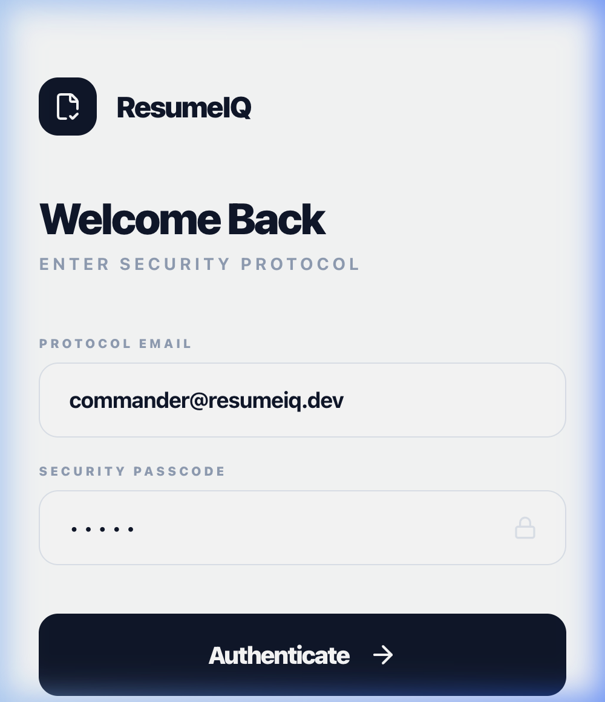
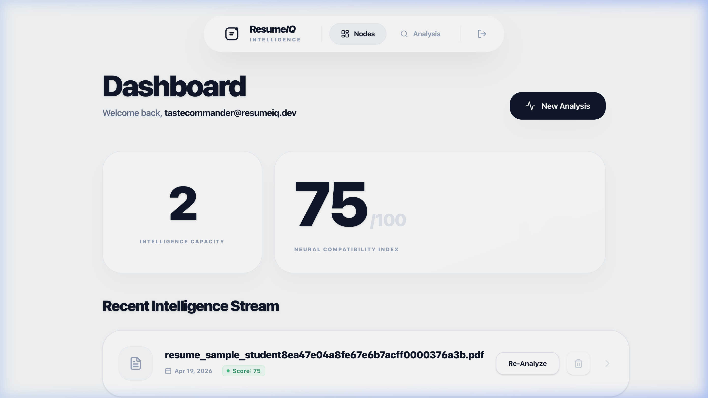
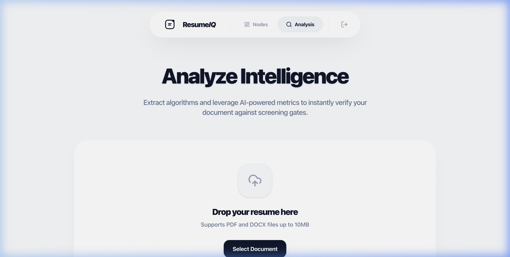

# ResumeIQ Intelligence Engine 🧠

> **High-Fidelity Document Synthesis & Predictive Interview Intelligence.**

ResumeIQ is a premium, monochrome career intelligence platform designed to bridge the gap between static resumes and dynamic job requirements. By leveraging neural synthesis and heuristic-based scoring, ResumeIQ provides candidates with a data-driven path to recruitment success.

## 🌐 Live Demo

🔗 **[ResumeIQ Intelligence Engine — Live](https://resumeiq-intelligence-engine-app.netlify.app/)**

🎥 Demo Video

👉 https://drive.google.com/file/d/1GBhV7Xi4I9YD50o0mbFbhBgKLh47y_tK/view

## 📸 Screenshots

### Login Portal


### Dashboard


### Analysis Engine


## ⚡ Core Intelligence Modules

### 🔍 ATS Scoring Engine
Native, heuristic-based evaluation of skills density, experience mapping, and formatting constraints. Get an instant mathematical breakdown of your document's "recruitability."

### 🎯 Job Target Alignment
Neural resonance comparison between your resume and raw job descriptions. Identifies verified "Hits" and critical "Missing Parameters" to ensure your document clears automated screening gates.

### 🧠 Behavioral Interview Predictor
Sophisticated synthesis model that analyzes your actual achievement data against job requirements to predict high-impact interview scenarios. Generates "Precision Responses" tailored specifically to your history.

### ✍️ AI Rewrite Terminal
Real-time, command-based phrasing engine. Transform weak bullet points into high-performance achievement statements using specialized achievement modeling.

## 🛠️ Technical Stack

- **Frontend**: React 18 + Vite
- **Styling**: Tailwind CSS v4 + Framer Motion (Perpetual Spring Physics)
- **Intelligence**: Google Gemini Flash (Generative AI)
- **Identity**: Firebase Authentication
- **Data**: Firestore (Real-time synchronization)

## 🚀 Getting Started

1. **Clone & Install**:
   ```bash
   npm install
   ```

2. **Environment Configuration**:
   Create a `.env` file with your Gemini API Key:
   ```env
   VITE_GEMINI_API_KEY=your_key_here
   ```

3. **Launch Terminal**:
   ```bash
   npm run dev
   ```

## 🔒 Privacy Architecture
ResumeIQ uses native client-side parsers (`pdfjs-dist`). Your documents are processed locally, ensuring that raw PII data never leaves your secure environment until you explicitly decide to establish a record.

---
*Built for the future of recruitment intelligence.*
